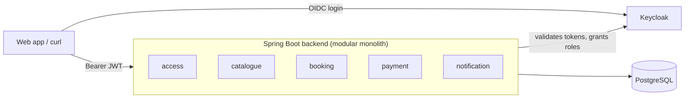

<h1 align="center">GetMySeat</h1>

<p align="center">
  A live-event ticketing platform that never sells the same seat twice.
</p>

<p align="center">
  <a href="https://github.com/BiLaL-159/getMySeat/actions/workflows/ci.yml"></a>
  
  
  
  
</p>

<p align="center">
  <a href="#quickstart">Quickstart</a> ·
  <a href="docs/api.md">API reference</a> ·
  <a href="docs/walkthrough.md">Walkthrough</a> ·
  <a href="docs/load-test.md">Load test report</a> ·
  <a href="docs/configuration.md">Configuration</a>
</p>

---

GetMySeat lets **Organizers** list Events and schedule Shows at Venues, and lets **Customers** hold and pay for tickets, either numbered Seats or General Admission places. Every ticket is claimed inside a single PostgreSQL transaction, so two Customers racing for the last seat get exactly one winner.

> [!NOTE]
> GetMySeat is under active development. Phase 2 is complete: per-Show inventory and Holds work today, and they're backed by a 500-thread concurrency test and a k6 load test. Bookings and payments (Phase 3) are next.

## Table of contents

- [Features](#features)
- [Quickstart](#quickstart)
- [Usage](#usage)
- [Demo: holding Seats](#demo-holding-seats)
- [Architecture](#architecture)
- [Development](#development)
- [Contributing](#contributing)

## Features

- **Seated and General Admission inventory.** A Venue is made of Sections that are either numbered Seats or a capacity count, and a Show can mix both.
- **No double-selling.** Seats are claimed with conditional updates (`AVAILABLE → HELD`) and General Admission with a decrement that can't go below zero, all or nothing in one transaction. A test races 500 Customers for one Seat and gets exactly one Hold, and 500 for 100 General Admission places and gets exactly 100. A [k6 load test](docs/load-test.md) runs 300 Customers against the compose stack for almost two minutes and finds no Seat held twice and no Section oversold.
- **Holds.** A Customer holds up to 10 tickets while they pay. A Hold expires on its own after 10 minutes by default, can be released early, and a Customer has at most one active Hold per Show.
- **Organizer onboarding.** A Customer applies to become an Organizer, and approval grants the role in Keycloak.
- **Moderated Venues.** Organizers propose Venues with their layout, Admins approve them, and an approved layout is fixed.
- **Events, Shows and pricing.** Organizers draft and publish Events, schedule Shows and set a price per Section.
- **Public browsing.** Anyone can search Events by text, city, category and date, and see a Show's live availability.
- **A consistent REST API.** Versioned under `/api/v1`, RFC 9457 problem details for every error, validated pagination and sorting, and an OpenAPI spec with Swagger UI.

## Quickstart

You need [Docker](https://docs.docker.com/get-docker/) with Compose.

```bash
git clone https://github.com/BiLaL-159/getMySeat.git
cd getMySeat
docker compose up -d --build --wait
curl localhost:8080/actuator/health   # {"status":"UP",...}
```

This starts:

| Service | URL |
|---|---|
| Backend API | http://localhost:8080 |
| Swagger UI | http://localhost:8080/swagger-ui.html |
| Keycloak | http://localhost:8180 (realm `getmyseat`) |
| PostgreSQL | `localhost:5432`, database `getmyseat` |

To start over with an empty database, run `docker compose down -v`.

### Seed a catalogue

With the stack running, fill it with sample data. You'll need `curl` and `jq`:

```bash
scripts/seed.sh
```

It uses the public API as the seed `organizer` and `platform-admin` to create six approved Venues with Seated and General Admission Sections, and six published Events with priced Shows over the next six weeks in Mumbai, Bengaluru, New Delhi, Pune and Hyderabad. Running it again is safe. It finds Venues and Events by name, finishes anything a previous run left half-done, and only adds Shows to replace ones that have since started. Set `API_URL` or `KEYCLOAK_URL` to point it somewhere other than `localhost:8080` and `localhost:8180`.

## Usage

Fetch a token for one of the seed users and call the API:

```bash
TOKEN=$(curl -s -d grant_type=password -d client_id=getmyseat-dev-cli \
  -d username=customer -d password=password \
  localhost:8180/realms/getmyseat/protocol/openid-connect/token | jq -r .access_token)

curl -s -H "Authorization: Bearer $TOKEN" localhost:8080/api/v1/me
```

Browsing needs no token at all:

```bash
curl -s 'localhost:8080/api/v1/events?city=mumbai&category=MUSIC' | jq
```

- The [walkthrough](docs/walkthrough.md) takes one Customer from applying as an Organizer to a published, priced Show, entirely with `curl`.
- The [API reference](docs/api.md) covers every endpoint, who can call it and how it fails.
- Swagger UI lists the same endpoints interactively; use *Authorize* to paste a token.

## Demo: holding Seats

This demo publishes a Show and has two Customers race for the same Seats. It uses the seed users, `curl`, `jq` and `uuidgen`.

**1. Set up helpers and publish a Show** with a Seated Section of 10 Seats, as the seed Organizer, with the Venue approved by the seed Admin:

```bash
token() {
  curl -s -d grant_type=password -d client_id=getmyseat-dev-cli -d username="$1" -d password=password \
    localhost:8180/realms/getmyseat/protocol/openid-connect/token | jq -r .access_token
}
api() {  # api METHOD PATH TOKEN [JSON] [IDEMPOTENCY-KEY]
  local args=(-s -X "$1" "localhost:8080/api/v1$2" -H "Authorization: Bearer $3")
  if [ -n "$4" ]; then args+=(-H 'Content-Type: application/json' -d "$4"); fi
  if [ -n "$5" ]; then args+=(-H "Idempotency-Key: $5"); fi
  curl "${args[@]}"
}
ORGANIZER=$(token organizer); ADMIN=$(token platform-admin)
VENUE=$(api POST /venues "$ORGANIZER" \
  '{"name":"Demo Hall","address":"Worli","city":"Mumbai","timeZone":"Asia/Kolkata"}' | jq -r .id)
STALLS=$(api POST "/venues/$VENUE/sections" "$ORGANIZER" \
  '{"name":"Stalls","kind":"SEATED","rows":[{"label":"A","seatCount":10}]}' | jq -r .id)
api POST "/venues/$VENUE/submit" "$ORGANIZER" > /dev/null
api POST "/admin/venues/$VENUE/approve" "$ADMIN" | jq .status   # "APPROVED"
EVENT=$(api POST /events "$ORGANIZER" \
  '{"title":"Hold demo","description":"Phase 2 demo.","category":"MUSIC","language":"en"}' | jq -r .id)
api POST "/events/$EVENT/publish" "$ORGANIZER" > /dev/null
STARTS_AT=$(date -u -v+30d +%Y-%m-%dT14:30:00Z 2>/dev/null || date -u -d +30days +%Y-%m-%dT14:30:00Z)
SHOW=$(api POST "/events/$EVENT/shows" "$ORGANIZER" "{\"venueId\":\"$VENUE\",\"startsAt\":\"$STARTS_AT\"}" | jq -r .id)
api PUT "/shows/$SHOW/prices" "$ORGANIZER" \
  "{\"prices\":[{\"sectionId\":\"$STALLS\",\"amountPaise\":450000,\"currency\":\"INR\"}]}" > /dev/null
api POST "/shows/$SHOW/publish" "$ORGANIZER" | jq .status       # "PUBLISHED"
```

**2. View availability anonymously.** Publishing gave the Show its own inventory, and every Seat is free:

```bash
curl -s "localhost:8080/api/v1/shows/$SHOW/availability" | jq -c '[.sections[0].seats[:3][].available]'   # [true,true,true]
read -r SEAT1 SEAT2 < <(curl -s "localhost:8080/api/v1/shows/$SHOW/availability" | jq -r '[.sections[0].seats[:2][].id] | join(" ")')
```

**3. Hold two Seats as Customer A** (the seed `customer`). The Hold has its prices and its expiry time, and the Seats are now taken:

```bash
A=$(token customer)
KEY=$(uuidgen)
REQUEST="{\"seats\":[\"$SEAT1\",\"$SEAT2\"]}"
HOLD=$(api POST "/shows/$SHOW/holds" "$A" "$REQUEST" "$KEY" | tee /dev/stderr | jq -r .id)
# {"id":"d4eb…","status":"ACTIVE","expiresAt":"…","items":[{"kind":"SEAT","rowLabel":"A","seatNumber":1,…}, …],"totalPaise":900000,…}
curl -s "localhost:8080/api/v1/shows/$SHOW/availability" | jq -c '[.sections[0].seats[:3][].available]'   # [false,false,true]
```

**4. Fail to take them as Customer B.** Every seed user is a Customer, so the seed `organizer` plays B. Nothing is held, and the `409` names the Seats:

```bash
B=$(token organizer)
api POST "/shows/$SHOW/holds" "$B" "$REQUEST" "$(uuidgen)" | jq '{type, unavailableSeats}'
# { "type": "urn:getmyseat:problem:inventory-unavailable", "unavailableSeats": ["<SEAT1>", "<SEAT2>"] }
```

**5. Retry A's request with the same key**, as a client would after losing the response. The same Hold comes back and nothing more is held:

```bash
api POST "/shows/$SHOW/holds" "$A" "$REQUEST" "$KEY" | jq -r .id   # the same id as $HOLD
```

**6. Release the Hold and see the Seats free again:**

```bash
api POST "/holds/$HOLD/release" "$A" | jq .status   # "RELEASED"
curl -s "localhost:8080/api/v1/shows/$SHOW/availability" | jq -c '[.sections[0].seats[:3][].available]'   # [true,true,true]
```

To watch a Hold expire instead, restart the backend with a short Hold time, hold the Seats again and wait. The cleanup job gives the Seats back within one cleanup interval of the expiry:

```bash
HOLD_TIME=30s HOLD_CLEANUP_INTERVAL=5s docker compose up -d --wait backend
A=$(token customer)
api POST "/shows/$SHOW/holds" "$A" "$REQUEST" "$(uuidgen)" | jq .status   # "ACTIVE"
sleep 40
curl -s "localhost:8080/api/v1/shows/$SHOW/availability" | jq -c '[.sections[0].seats[:3][].available]'   # [true,true,true]
docker compose up -d --wait backend   # back to 10 minutes
```

**7. The proof under contention.** `HoldContentionApiIT` races 500 Customers, each with its own token and `Idempotency-Key`, for one Seat, and gets exactly one `201` and 499 `409`s. It also races 500 Customers for 100 General Admission places and gets exactly 100 Holds. Run it with:

```bash
cd backend && ./mvnw verify -Dit.test=HoldContentionApiIT -Dtest=none -Dsurefire.failIfNoSpecifiedTests=false
```

The [load test report](docs/load-test.md) shows the same guarantees across the whole stack under k6: 300 Customers, about 37,000 Hold attempts, no `5xx`, and no Seat or place sold twice.

### Seed users

The local stack imports a Keycloak realm with these accounts. They are for development only; never reuse them anywhere else.

| Account | Username | Password |
|---|---|---|
| Customer | `customer` | `password` |
| Organizer | `organizer` | `password` |
| Admin | `platform-admin` | `password` |
| Keycloak admin console | `admin` | `admin` |
| PostgreSQL | `getmyseat` | `getmyseat` |

<details>
<summary>Keycloak clients</summary>

The realm defines the `CUSTOMER`, `ORGANIZER` and `ADMIN` roles, and everyone who registers gets `CUSTOMER`. Access tokens must carry the `getmyseat-api` audience.

| Client | Type | Used for |
|---|---|---|
| `getmyseat-frontend` | Public | The web app, with Authorization Code + PKCE |
| `getmyseat-dev-cli` | Public, **dev only** | Fetching tokens with `curl` through the password grant |
| `getmyseat-backend` | Confidential | The backend's service account, which grants `ORGANIZER` when an Admin approves an application. Dev secret: `getmyseat-backend-dev-secret` |

The realm lives in [`infra/keycloak/getmyseat-realm.json`](infra/keycloak/getmyseat-realm.json) and is imported on startup.

</details>

## Architecture



The backend is a modular monolith. Each module under `com.getmyseat` owns its tables and talks to the others only through their public APIs, so modules can later be extracted into services.

| Module | Responsibility |
|---|---|
| `access` | Token validation, roles, Organizer Applications |
| `catalogue` | Venues, Sections and Seats, Events, Shows, Section Prices |
| `booking` | Per-Show inventory, availability and Holds |
| `payment` | Payments and refunds (planned) |
| `notification` | Emails to Customers (planned) |

PostgreSQL is the single source of truth for inventory. Holds rely on row-level conditional updates and a partial unique index rather than application locks, and schema changes are versioned with Flyway.

### Tech stack

| Area | Choice |
|---|---|
| Backend | Java 21, Spring Boot 4, Maven |
| Persistence | PostgreSQL 17, Spring Data JPA, Flyway |
| Identity | Keycloak 26 (OAuth 2.0 / OpenID Connect) |
| Testing | JUnit 5, Testcontainers |
| Frontend | React, TypeScript, Vite |
| CI | GitHub Actions |

## Development

Prerequisites: Docker, JDK 21 and Node 24.

### Backend

Run the dependencies in Docker and the backend on your machine:

```bash
docker compose up -d postgres keycloak
cd backend && ./mvnw spring-boot:run
```

Every setting has a default that points at the compose stack. See [configuration](docs/configuration.md) to override them.

### Frontend

```bash
cd frontend && npm install && npm run dev   # http://localhost:5173
```

The frontend is currently a scaffold; the screens arrive alongside the backend phases.

### Tests

```bash
cd backend && ./mvnw verify   # needs Docker running
```

The integration tests boot the full application against PostgreSQL in Testcontainers and call it over HTTP.

- **API tests** (`@ApiIntegrationTest`) use `TestJwts` to mint signed tokens for any subject and roles, so real token validation runs without a live Keycloak. `FakeRoleGrants` stands in for the Keycloak Admin API and can be told to fail.
- **Keycloak tests** (`KeycloakRealmIT`, `KeycloakRoleGrantsIT`) boot Keycloak from the committed realm export and check the seed users, token audiences and role grants against the real thing.
- **`ApplicationHealthIT`** runs the Flyway migrations and checks that the app and its database report `UP`.

### Load test

A [k6](https://k6.io) script, [`load-test/holds.js`](load-test/holds.js), races 300 Customers for the Seats and General Admission places of one Show. The results are in the [load test report](docs/load-test.md). With the stack running, start the test with:

```bash
docker compose up -d --build --wait
docker compose run --rm k6
```

k6 runs as a container on the compose network, so you don't need to install it. The test takes about two minutes, and needs the default Hold time, since its post-run check assumes no Hold expires during the run. Its setup creates Customer accounts `k6-customer-0001` to `k6-customer-0300` in the dev Keycloak, reusing them on later runs, and publishes a new Show as the seed Organizer. The run fails if any response is a `5xx`, if any check fails, or if the post-run check finds a Seat held twice or a General Admission Section oversold. Set `CUSTOMERS` to change the number of Customers and virtual users, for example `docker compose run --rm -e CUSTOMERS=100 k6`. To use a local k6 against the published ports instead, run `k6 run load-test/holds.js`. The load test isn't part of CI.

CI runs `./mvnw verify` for the backend and `npm run lint` and `npm run build` for the frontend on every push and pull request.

### Project layout

```
.
├── backend/              Spring Boot application
│   └── src/main/java/com/getmyseat/
│       ├── access/       authentication, roles, Organizer Applications
│       ├── catalogue/    Venues, Events, Shows, prices
│       ├── booking/      inventory, availability, Holds
│       ├── payment/      (planned)
│       ├── notification/ (planned)
│       └── shared/api/   error handling, pagination, OpenAPI
├── frontend/             React + Vite app
├── infra/keycloak/       Keycloak realm export
├── load-test/            k6 load test for Holds
├── scripts/              seed.sh, which fills the local stack with sample data
├── docs/                 API reference, walkthrough, configuration, load test report
└── docker-compose.yml    local stack
```

## Contributing

Issues and pull requests are welcome. Before opening a pull request:

1. Open or find an issue that describes the change.
2. Branch off `main` (for example `feat/42-short-name`).
3. Make sure `./mvnw verify` in `backend/` and `npm run lint && npm run build` in `frontend/` pass.
4. Keep API changes consistent with the [conventions](docs/api.md#conventions) and update [the API reference](docs/api.md).
